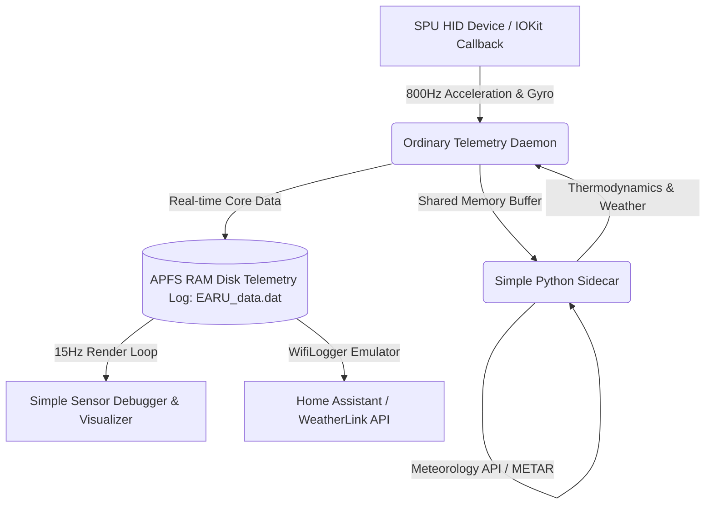

# EnvironmentalAwareReferentialUnit (EARU)

> [!WARNING]
> **THIS is NOT an accurate physical device, it will drift eventually! If you want exact medical or physics measurements, use professional external sensors!**

**Original Concept:** [Olivier Bourbonnais](https://github.com/olvvier)  
**Modified with Love by:** [Albert Starfield Wahyu Suryo Samudro](mailto:albertstarfield2001@gmail.com)  
**Version:** `Amaryllis Twilight Migratory`

---

## What is this?
This is a humble, ordinary project built to read the undocumented built-in MEMS sensors on modern Apple Silicon MacBooks (M2/M3/M4/M5) and turn them into a neat and simple set of indicators. It is created to be minimum capable, friendly, and easy to run.



### 1. The Ordinary Daemon Core (`EARU_daemon`)
*   **Humble Sampling:** Just does ordinary, straightforward readings of the Apple SPU (Sensor Processing Unit) HID reports via simple callbacks to capture acceleration, gyroscope, lid angle, and ambient light sensors.
*   **Simple Attitude Estimation:** Uses a standard Mahony filter to compute simple pitch, roll, and yaw angles from the device motion.
*   **Simple Pedometer Engine:** Helps count walking steps cleanly and places the calculated number at the root of the telemetry data.
*   **Caution & Warning Engine:** Provides simple indicators if something looks off or needs attention (like cosmic upsets or high memory use).

### 2. The Simple Python Sidecar (`earu_ml_bridge.py`)
*   **Basic Thermodynamics:** Translates fan RPMs and temperature readouts into simple convective heatflux ($J/s$) and massflow ($kg/s$) estimations.
*   **Thermodynamic Efficiency Solver:** Compares battery full vs design capacities to calculate a simple computational Work Efficiency ($100 - \text{cooling\_efficiency\_pct}$).
*   **Vibration Assessment:** Measures simple CUSUM and RMS metrics of physical vibrations through the chassis.
*   **Self-Bootstrapping**: Automatically handles setting up a local virtual environment (`.venv`) and synchronizing dependencies, so you don't have to worry about packages.

### 3. The Cozy OpenGL Sensor Debugger & Visualizer (`SensorTerminalMonitor.py`)
*   **Simple Debug Display:** An interactive dashboard panel featuring beautiful visual graphics and real-time attitude indicators to see exactly what the sensors are doing.
*   **Push-to-Reset Warning Buttons:** Friendly, interactive **MASTER WARNING** and **MASTER CAUTION** buttons at the top-right that blink during alarms and stay dim and quiet once clicked.
*   **Hourly Average Work Efficiency:** Keeps track of dynamic efficiency trends over the last hour using a simple running average.
*   **Individual Axis Velocities:** Draws simple visual indicators for individual X, Y, and Z coordinate speeds.
*   **Heartbeat Monitor (BCG):** Measures heartbeat rates through tiny chassis vibrations when placing wrists near the trackpad, displaying neighboring entity count simply as a stated number.

---

## Prerequisites & Requirements

To compile and run the ordinary daemon and its cozy sensor debugger on your MacBook, you will need a few standard developer tools:

1. **Apple Silicon MacBook:** Native SPU HID readings are designed specifically for Apple Silicon M-series chips (M2, M3, M4, M5, etc.).
2. **Xcode Command Line Tools:** Essential for native compilation of C-bindings, building scripts, and Homebrew:
   ```bash
   xcode-select --install
   ```
3. **Homebrew:** The standard macOS package manager, required to install terminal utilities and compiler toolchains.
4. **Alire (`alr`):** The build and dependency manager for GNAT compiler suites, used to compile the ordinary daemon core. Install it easily via:
   ```bash
   brew install alire
   ```
5. **Python 3.12+ / PIP / Anaconda:** Python environment to run the thermodynamic sidecar and OpenGL dashboard. The scripts will automatically bootstrap local virtualenvs (`.venv` and `.venv_pfd`) for package management.
6. **CoreLocationCLI:** A helper command-line utility used to query local GPS coordinates and altitude for the positioning reckoners:
   ```bash
   brew install corelocationcli
   ```
7. **smcDemandNow Daemon:** A privileged utility compiled as part of the core daemon sequence that allows the bridge sidecar to query active fan states and override SMC thermal control loop constraints on-demand during alert events.

---

## How to Try it

### 1. One-Click Setup & Launch
We have unified everything into a single, self-contained startup script that compiles, cleans, and runs the daemon persistently:

```bash
# Clone the repository
git clone https://github.com/albertstarfield/EnvironmentalAwareReferentialUnit.git
cd EnvironmentalAwareReferentialUnit

# Start setup & build in 3 seconds!
sudo ./start.sh
```

### 2. Run the Debugger & Visualizer
To open the cozy visual debug and telemetry monitor dashboard, simply run:

```bash
python3 SensorTerminalMonitor.py
```

### 3. Manage the Background Service
The background daemon persistently runs as a persistent service. You can install, stop, or restart the background service instantly using:

```bash
sudo bash restart_service.sh
```

---

## Davis WiFiLogger API Compatibility
EARU emulates the local API of a **Davis Instruments WiFiLogger 2 / WeatherLinkIP** on port `3270`. This allows weather stations or home automation software (like Home Assistant or Cumulus MX) to read your local data.

*   **REST Endpoints:** `/`, `/wflexp.json`, `/wflexpj.json`, `/wflarch.json`
*   **Davis Mapping:** Indoor/outdoor temperatures, local barometric pressure, wind speeds, dew points, and humidity.

---

## Tested Hardware Compatibility

This program reads raw hardware registers and MEMS sensors directly via Apple's SPU interface, and has been verified to run beautifully on:
* **Tested & Validated:** Apple Silicon MacBook Pro 14" M2 Pro (Model **A2779**)

---

## Technical Files & Directory Structure

*   `start.sh` - Unified, self-contained startup, build, and daemon execution script.
*   `SensorTerminalMonitor.py` - Cozy interactive OpenGL sensor debugger and visual monitor dashboard.
*   `com.earu.service.plist` - Persistent background service configuration.
*   `restart_service.sh` - Restarts the background service.
*   `howtoread_EARU_data.dat.md` - Complete, friendly reference guide to telemetry data variables.
*   `EARU_daemon/` - Native ordinary telemetry daemon source.
*   `EARU_daemon/python/earu_ml_bridge.py` - Self-bootstrapping thermodynamic Python sidecar.
*   `EARU_LegacyPython/` - Archived legacy Python modules for development reference.
