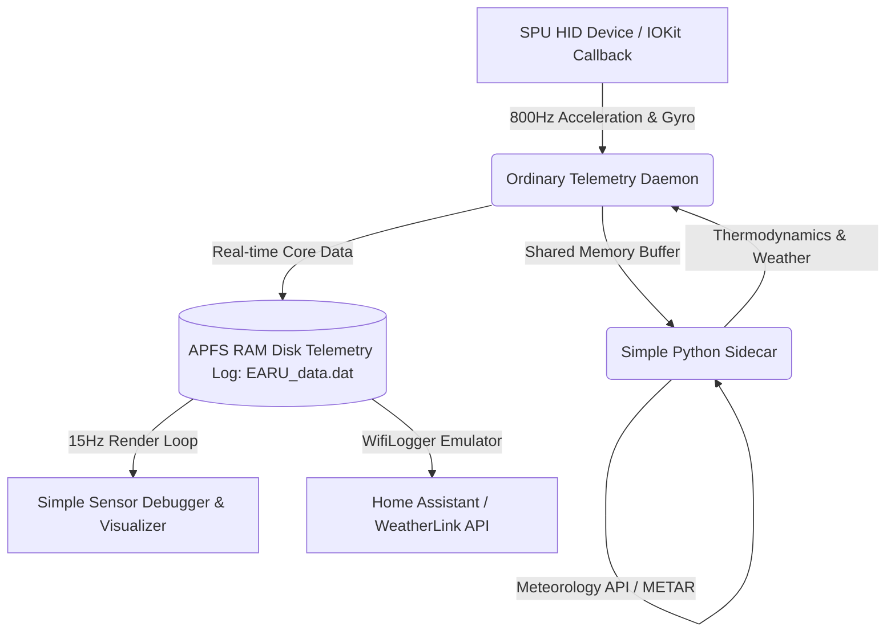

# EnvironmentalAwareReferentialUnit (EARU)

> [!WARNING]
> **THIS is NOT an accurate physical device, it will drift eventually! If you want exact medical or physics measurements, use professional external sensors!**

**Original Concept:** [Olivier Bourbonnais](https://github.com/olvvier)  
**Modified with Love by:** [Albert Starfield Wahyu Suryo Samudro](mailto:albertstarfield2001@gmail.com)  
**Version:** `Amaryllis Twilight Migratory`

---

## What is this?
This is a humble, ordinary project built to read the undocumented built-in MEMS sensors on modern Apple Silicon MacBooks (M2/M3/M4/M5) and turn them into a neat and simple set of indicators. It is created to be minimum capable, friendly, and easy to run.



### 1. The Ordinary Daemon Core (`EARU_daemon`)
*   **Humble Sampling:** Just does ordinary, straightforward readings of the Apple SPU (Sensor Processing Unit) HID reports via simple callbacks to capture acceleration, gyroscope, lid angle, and ambient light sensors.
*   **Simple Attitude Estimation:** Uses a standard Mahony filter to compute simple pitch, roll, and yaw angles from the device motion.
*   **Simple Pedometer Engine:** Helps count walking steps cleanly and places the calculated number at the root of the telemetry data.
*   **Caution & Warning Engine:** Provides simple indicators if something looks off or needs attention (like cosmic upsets or high memory use).

### 2. The Simple Python Sidecar (`earu_ml_bridge.py`)
*   **Basic Thermodynamics:** Translates fan RPMs and temperature readouts into simple convective heatflux ($J/s$) and massflow ($kg/s$) estimations.
*   **Thermodynamic Efficiency Solver:** Compares battery full vs design capacities to calculate a simple computational Work Efficiency ($100 - \text{cooling\_efficiency\_pct}$).
*   **Vibration Assessment:** Measures simple CUSUM and RMS metrics of physical vibrations through the chassis.
*   **Self-Bootstrapping**: Automatically handles setting up a local virtual environment (`.venv`) and synchronizing dependencies, so you don't have to worry about packages.

### 3. The Cozy OpenGL Sensor Debugger & Visualizer (`SensorTerminalMonitor.py`)
*   **Simple Debug Display:** An interactive dashboard panel featuring beautiful visual graphics and real-time attitude indicators to see exactly what the sensors are doing.
*   **Push-to-Reset Warning Buttons:** Friendly, interactive **MASTER WARNING** and **MASTER CAUTION** buttons at the top-right that blink during alarms and stay dim and quiet once clicked.
*   **Hourly Average Work Efficiency:** Keeps track of dynamic efficiency trends over the last hour using a simple running average.
*   **Individual Axis Velocities:** Draws simple visual indicators for individual X, Y, and Z coordinate speeds.
*   **Heartbeat Monitor (BCG):** Measures heartbeat rates through tiny chassis vibrations when placing wrists near the trackpad, displaying neighboring entity count simply as a stated number.

---

## Prerequisites & Requirements

To compile the ordinary daemon, run the interactive sensor debugger, and execute the quality approval suite, you will need the following tools:

### 1. Core Development Toolchain
*   **Apple Silicon MacBook**: Native SPU HID readings are optimized specifically for Apple Silicon (M2, M3, M4, M5, etc.).
*   **Xcode Command Line Tools**: Essential for native C-bindings, building scripts, and Homebrew:
    ```bash
    xcode-select --install
    ```
*   **Homebrew**: The standard macOS package manager, used to install Alire and terminal utilities.
*   **Python 3.12+**: Python environment for the thermodynamic sidecar and OpenGL dashboard. The project automatically handles bootstrapping local virtualenvs (`.venv` and `.venv_pfd`) for you.
*   **CoreLocationCLI**: Query local GPS coordinates and altitude for dead reckoning:
    ```bash
    brew install corelocationcli
    ```
*   **smcDemandNow Daemon**: Built automatically to fetch/override SMC fan and thermals under alert states.

### 2. GNAT & SPARK Verification Toolchain (Alire)
*   **Alire (`alr`)**: The package and build manager for Ada and SPARK:
    ```bash
    brew install alire
    ```
*   **GNAT Native Compiler & GNATprove**: The compiler and formal verification tools are automatically configured within Alire. To verify your selected toolchain, run:
    ```bash
    alr toolchain
    ```
*   **Execution Context**: All compilation and static analysis commands must be run within the Alire environment wrapper:
    ```bash
    alr exec -- gnatprove -P earu_daemon.gpr
    ```

### 3. Test Frameworks & Dependencies
*   **AUnit (`aunit`)**: The standard Ada unit testing framework. It is declared as a package dependency in `alire.toml` and is automatically fetched, compiled, and linked by Alire during project build/test execution.
*   **Strategy (`strategy`)**: The property-based testing framework for Ada. It is automatically resolved and built by Alire as a package dependency.
*   **Ahven (`ahven`)**: A lightweight unit testing library modeled after JUnit.
    > [!NOTE]
    > `ahven` is not in the default community Alire index. If you need it for legacy test modules:
    > 1. Download the source package from the [Ahven Official Site](http://www.ahven-framework.com/).
    > 2. Build and install it manually or integrate it as a local Alire index pin.
    > 3. Alternatively, you can use the `utilada_unit` package, which is in the Alire index and includes Ahven compatibility layers.

### 4. Code Coverage Toolchain
*   **GNATcov**: The GNAT Coverage analysis tool.
    *   **Installation via Alire**: You can choose an Alire-managed GNATcov toolchain using:
        ```bash
        alr toolchain --select gnatcov
        ```
    *   **Coverage Reports**: Run the coverage check with `--annotate=xcov` to output rich source-annotated reports:
        ```bash
        alr exec -- gnatcov run -P earu_daemon.gpr --annotate=xcov ./bin/earu_daemon
        ```

### 5. AFL++ Fuzz Testing Toolchain
*   **AFL++ (American Fuzzy Lop)**: A state-of-the-art fuzzer utilized to discover memory errors and edge-case exceptions in compiled binaries.
    *   **Installation**: Install AFL++ via Homebrew:
        ```bash
        brew install afl++
        ```
    *   **Ada Instrumentation**:
        To instrument your Ada code for fuzzing, you must compile the daemon using one of the AFL++ compiler wrappers (like `afl-gcc` or `afl-clang-fast`):
        ```bash
        CC=afl-gcc alr build
        ```
    *   **Running Fuzzer**: Create seed input corpus and run the fuzzer:
        ```bash
        afl-fuzz -i inputs_dir -o outputs_dir ./bin/earu_daemon
        ```

---

## How to Try it

### 1. One-Click Setup & Launch
We have unified everything into a single, self-contained startup script that compiles, cleans, and runs the daemon persistently:

```bash
# Clone the repository
git clone https://github.com/albertstarfield/EnvironmentalAwareReferentialUnit.git
cd EnvironmentalAwareReferentialUnit

# Start setup & build in 3 seconds!
sudo ./start.sh
```

### 2. Run the Debugger & Visualizer
To open the cozy visual debug and telemetry monitor dashboard, simply run:

```bash
python3 SensorTerminalMonitor.py
```

### 3. Manage the Background Service
The background daemon persistently runs as a persistent service. You can install, stop, or restart the background service instantly using:

```bash
sudo bash restart_service.sh
```

---

## Davis WiFiLogger API Compatibility
EARU emulates the local API of a **Davis Instruments WiFiLogger 2 / WeatherLinkIP** on port `3270`. This allows weather stations or home automation software (like Home Assistant or Cumulus MX) to read your local data.

*   **REST Endpoints:** `/`, `/wflexp.json`, `/wflexpj.json`, `/wflarch.json`
*   **Davis Mapping:** Indoor/outdoor temperatures, local barometric pressure, wind speeds, dew points, and humidity.

---

## Tested Hardware Compatibility

This program reads raw hardware registers and MEMS sensors directly via Apple's SPU interface, and has been verified to run beautifully on:
* **Tested & Validated:** Apple Silicon MacBook Pro 14" M2 Pro (Model **A2779**)

---

## Technical Files & Directory Structure

*   `start.sh` - Unified, self-contained startup, build, and daemon execution script.
*   `SensorTerminalMonitor.py` - Cozy interactive OpenGL sensor debugger and visual monitor dashboard.
*   `com.earu.service.plist` - Persistent background service configuration.
*   `restart_service.sh` - Restarts the background service.
*   `howtoread_EARU_data.dat.md` - Complete, friendly reference guide to telemetry data variables.
*   `EARU_daemon/` - Native ordinary telemetry daemon source.
*   `EARU_daemon/python/earu_ml_bridge.py` - Self-bootstrapping thermodynamic Python sidecar.
*   `EARU_LegacyPython/` - Archived legacy Python modules for development reference.

---

## Frequently Asked Questions (FAQ)

### Q: What is this?
**A:** The **Environmental Aware Referential Unit (EARU)** is a real-time physical telemetry framework that transforms a standard Apple Silicon MacBook into a unified inertial measurement system, environmental telemetry unit, and localized weather station. It merges a native **highly-optimized compiled 800Hz daemon** for real-time sensor processing with a JIT-compiled **Python sidecar** for dynamic environmental modeling, wind estimation, and emotional affect tracking.

### Q: Why do I need this?
**A:** If you are a systems engineer, embedded systems programmer, environmental researcher, or low-level software enthusiast, to measure, visualize, and analyze physical phenomena using only your laptop's native hardware. It allows you to:
*   Perform dead reckoning positioning and spatial attitude tracking.
*   Synthesize localized weather reports (METAR/TAF) using virtual "soft" sensors.
*   Detect structural seismic vibrations and calculate logic board solder joint fatigue.
*   Track dynamic air properties, mass flow rates, and energy survivability indices.

### Q: How is the proxy program structured?
**A:** The core telemetry daemon is built as compiled native proxy program designed to safely gather and relay sensor readings. It is structured to handle data safely and efficiently, reducing the chance of typical run-time exceptions (such as division by zero or buffer overflows) to keep the telemetry acquisition stable and working.

### Q: What hardware sensors does it utilize?
**A:** It directly taps into the MacBook's SPU (Sensor Processing Unit) interface and hardware registers to gather high-fidelity data:
*   **MEMS Accelerometer & Gyroscope** (sampled at $800.0\text{ Hz}$)
*   **Barometric Pressure Transducer** (SMC registers)
*   **Logic Board Thermal Resistors** (SMC registers)
*   **Ambient Light Sensors (ALS)** (SPU interface)
*   **Smart Battery Controller** (capacity, limits, health, power usage rates)
*   **Human Interface Device (HID) System** (user activity & keystroke inactivity)

### Q: Is this safe to run on my system?
**A:** Yes, entirely. The daemon and sidecar operate strictly in **read-only and non-invasive modes**. They do not modify any system files, macOS configurations, or hardware settings. All background processing is optimized via multi-rate scheduling to keep CPU usage minimal and preserve battery life. (different from smcDemandNow)

### Q: Can I use this telemetry stream for my own custom applications and daemons?
**A:** **Yes, absolutely!** This is one of EARU's primary selling points. Rather than locking these rich physical sensor readings behind closed OS subsystems (such as Apple's "Vehicle Motion Cues") or keeping them as a pure "visual flex" inside our terminal debugger, EARU exposes a unified, standardized binary data format (`EARU_data.dat`) and shared memory interface. You can tap into this real-time stream to fuel your own background daemons, desktop dashboard widgets, automation routines, or custom analytical applications.

### Q: Why does the viewer look like a sophisticated spacecraft?
**A:** What? What do you mean? I'm just viewing the sensor. Nothing to see here. 👀

### Q: What does this mean for our privacy?
**A:** Hmm... What do you think? I mean, it only uses local hardware readings without camera or microphone access... but even with simple movement, thermal signatures, and keyboard idle parameters, you can extract a lot. This is PoC of metadata extraction concept that we are all worried about on app algorithmic optimization arousal. This can be a privacy nightmare for some (But you do require superuser to read these sensors as far as i remember), but a dream for others. While i'm not an security analyst nor Computer Science just a person happened to use an laptop. **My suggestion is just add permission allow or deny on motions. on userspace. that way if the user doesnt want to share their motion data they can just deny it. but keep option for allow access to this data too. not completely lockout to balance ownership and privacy**

### Q: Wait hold on. What language is this written on? I never heard of this before.
**A:** Hmm... If you know, then you know. I'm pretty sure you do enjoy the ride and the butter 😉 (psst. I hate JavaScript)

### Q: What is the core system design philosophy?
**A:** Our entire design operates under **Murphy's Law**: *"Anything that can go wrong will go wrong."* 
Rather than hoping faults won't occur, EARU assumes they **will** happen. The system features a self-patching parity integrity engine, automated error recoveries, priority scheduling overrides, and strict constraints designed to keep the runtime reliable and operational under all circumstances.

### Q: Who are you that able to build this?
**A:** No one, or someone that having too much daydreaming and hallucinate of what if sci-fi is not sci-fi but actually after all there's already language model can translate my imagination and disciplinized for imagination.

 


